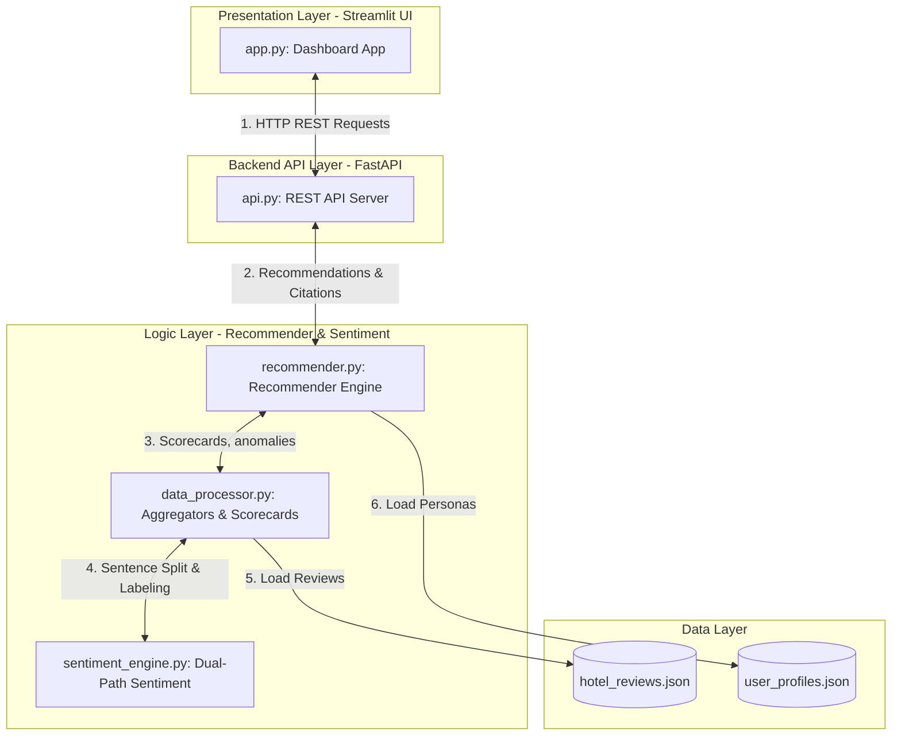

# Architecture & Technical Documentation

This document serves as the central architectural blueprint and reference for the **Expedia Hotel Review Sentinel (Sentinel)**.

---

## 1. System Architecture Overview

Sentinel is designed as a modular, AI-powered hotel intelligence engine that maps traveler personas to evidence-backed, multi-criteria ranked recommendations. 

---

## 2. Sentiment Engine (`sentiment_engine.py`)

Extracts aspect and sentiment labels from review sentences using a hybrid multi-path pipeline.

* **Normalized Fast Path**: Normalizes punctuation, spaces, and capitalization to perform $O(1)$ exact dictionary matches in `NORMALIZED_TEMPLATE_MAP`, bypassing encoding mismatches ($<0.01$ ms).
* **General Path**: Cosine similarity matching ($>0.80$) using `SentenceTransformer` (`all-MiniLM-L6-v2`) against template anchors.
* **Fallback Path**: Zero-Shot classification (`valhalla/distilbart-mnli-12-3`) for custom text inputs, with keyword-based rule fallbacks.

---

## 3. Data Processor Features (`data_processor.py`)

* **Aspect Scorecard Matrix**: Aggregates positive/negative sentiment mentions per hotel to calculate scorecard ratings ($1.0$ to $5.0$).
* **Anomaly Detector**: Flags recent cleanliness/service drops ($>20\%$) in the last 60 days, cross-referencing previous years to isolate and discard cyclical **Seasonal Drift**.

---

## 4. Local Season-Based Seasonality Engine

The seasonality analyzer groups monthly reviews into local seasons based on geography:
1. **Hemisphere Classification**: Parsed city names map to:
   * **Southern Hemisphere** (Sydney, Cape Town, Lima): Summer (Dec-Feb), Winter (Jun-Aug), Spring (Sep-Nov), Autumn (Mar-May).
   * **Tropical Monsoon** (Bali, Bangkok, Mumbai, Singapore, Mexico City): Dry Season (Nov-Apr), Wet Season (May-Oct).
   * **Northern Hemisphere** (Default): Summer (Jun-Aug), Winter (Dec-Feb), Spring (Mar-May), Autumn (Sep-Nov).
2. **Deviation Analysis**: Deviation of each season's score from the annual average:
   $$Dev_{season} = Score_{season} - Mean_{annual}$$
3. **Consistency Verification**:
   * **Dips**: Deviation $<-0.15$ in both 2024 and 2025.
   * **Peaks**: Deviation $>0.15$ in both 2024 and 2025.
4. **Resilience / Stability**: If no aspect shows consistent YoY dips/peaks, the hotel is labeled as **Operationally Stable** (maintaining consistent service quality regardless of seasons).

---

## 5. Recommender Engine (`recommender.py`)

* **Dynamic Aspect Priority Classifier**: Maps user descriptions (predefined profiles or custom inputs) to aspect weights dynamically.
  * **Predefined Profiles Matcher**: Uses a SentenceTransformer semantic similarity check with a threshold of **0.60** to map traveler descriptions to their closest pre-defined core archetypes (e.g. `P02` maps directly to `Business`), guaranteeing they load their exact fixed weights.
  * **12 Predefined Archetypes**: Covers Mobility-Needs, Business, Family, Budget, Luxury, Wellness, Solo-Traveler, Foodie, Beach-Holiday, Remote-Worker, Group-Leisure, and **Romantic** (honeymooners & couples).
* **MCDA Blended Ranking with Baseline Quality Penalty**:
  * Ranks hotels using a $80\%$ Aspect Score + $20\%$ Overall Reputation blend.
  * **Low Aspect Floor Penalty**: To prevent recommending hotels with critically low scores in universal aspects (Service, Cleanliness, WiFi/Quietness, Value, Location) even when they are weighted at $0\%$, a penalty is applied to any universal aspect score falling below $2.5$:
    $$\text{Penalty} = \sum_{\text{aspect}} 1.5 \times (2.5 - S_{\text{aspect}})$$
    Niche aspects (Accessibility, Family-Friendliness) are excluded from this general floor penalty.
  * **Accessibility Hard Filter**: Applies a **2.5-point rank penalty** to hotels with accessibility complaints if the traveler has mobility needs.

---

## 6. Structured RAG Citation Retrieval

Retrieves evidence citations by combining structured aspect filters and vector search:
1. **Traveler Cohort Filtering**: Detects the traveler type (`solo`, `family`, `couple`, `business`, `group`, `leisure`) from the profile description. Prioritizes reviews written by matching cohorts (i.e. solo travelers see reviews written by other solo travelers, avoiding corporate business center reviews).
2. **Aspect Filter & Slicing**: Filters reviews containing positive mentions for user core aspects (weight $> 0.15$), sorts by match intensity, and keeps the **top 15 candidates**.
3. **Vector Retrieval**: Computes dense vectors for the top 15 candidate texts using `SentenceTransformer` and calculates similarity scores against the user query.
4. **Blended Ranker**: Ranks citations based on a $70\%$ Cosine Similarity + $30\%$ Review Rating blend.
5. **Caching**: Caches review embeddings in-memory to speed up recommendations to milliseconds on subsequent runs.
